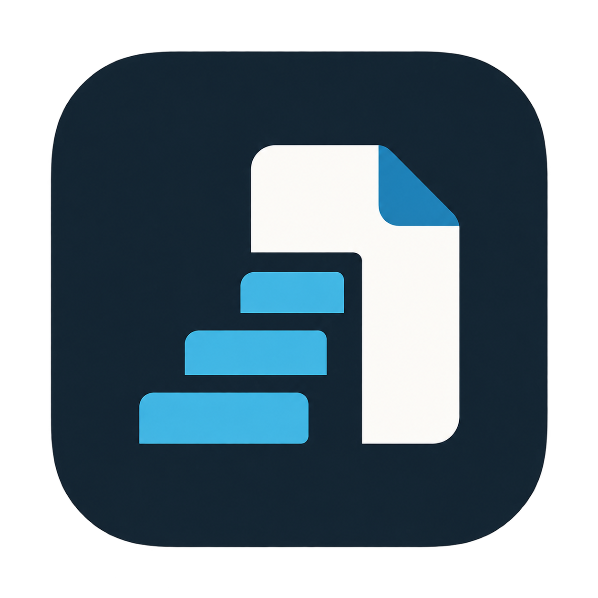
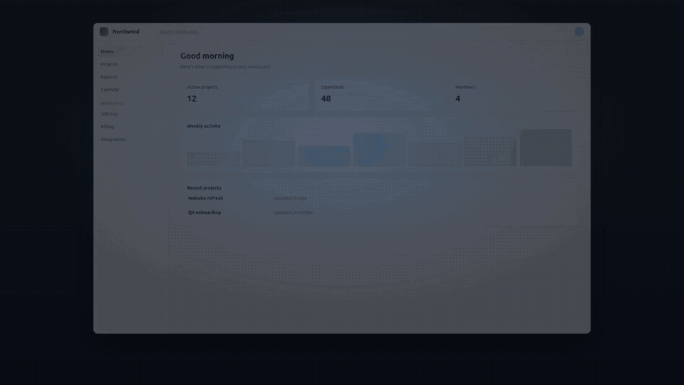

<p align="center">
  
</p>

<h1 align="center">StepForge</h1>

<p align="center">
  <strong>Turn what you click into a step-by-step guide.</strong><br>
  Free, open-source documentation capture for Windows and Linux.
</p>

<p align="center">
  <a href="https://github.com/Twest2/StepForge/releases/latest"></a>
  <a href="LICENSE"></a>
  
</p>

<p align="center">
  <a href="docs/linux/apt.md"></a>
  <a href="docs/linux/dnf.md"></a>
  <a href="docs/windows/chocolatey.md"></a>
</p>

<p align="center">
  <a href="docs/media/stepforge-demo.mp4"></a><br>
  <sub><a href="docs/media/stepforge-demo.mp4">Watch the full-quality video (MP4)</a></sub>
</p>

---

Writing a how-to guide usually means doing the task, stopping to take a
screenshot, cropping it, pasting it into a document, writing "click here",
and repeating that twenty times. StepForge does the tedious part for you.

Start a recording and work normally. **Every click becomes a step**: a
screenshot of the screen at the moment you clicked, a marker on exactly where
you clicked, and a suggested title. When you're done, polish the steps in the
editor and export a finished guide to PDF, Word, PowerPoint, Markdown, HTML,
and more.

> [!NOTE]
> The [Windows installation guide](docs/windows_installation.md) in this
> repository was recorded with StepForge. It's a good example of what the app
> produces. (It's still reconmended to install via Chocolatey so you get updates)

## Install

| Platform | Recommended | Guide |
| --- | --- | --- |
| **Windows 10 / 11** (64-bit) | Chocolatey · .exe| · [Chocolatey](docs/windows/chocolatey.md) [Windows](docs/windows_installation.md)|
| **Ubuntu 26.04** | APT repository | [Ubuntu](docs/linux/apt.md) |
| **Fedora 44 Workstation** | DNF repository | [Fedora](docs/linux/dnf.md) |
| **Other Linux** | Portable `.tar.gz` | [Linux overview](docs/linux/linux_install.md) |

Every build is also on the [Releases page](https://github.com/Twest2/StepForge/releases/latest).

**Windows (Chocolatey)**, from an Administrator PowerShell:

```powershell
choco source add --name=stepforge --source=https://packages.twestbrook.com/nuget/stepforge-choco/
choco install stepforge --source=stepforge -y
```

**Ubuntu 26.04:**

```bash
sudo mkdir -p /etc/apt/keyrings
sudo curl -fsSL -o /etc/apt/keyrings/stepforge.gpg \
  https://packages.twestbrook.com/debian/stepforge/keys/stepforge.gpg
echo "deb [arch=amd64 signed-by=/etc/apt/keyrings/stepforge.gpg] https://packages.twestbrook.com/debian/stepforge/ resolute main" \
  | sudo tee /etc/apt/sources.list.d/stepforge.list
sudo apt update && sudo apt install stepforge
```

**Fedora 44:** 
```bash
sudo tee /etc/yum.repos.d/stepforge-rpm.repo > /dev/null <<'EOF'
[stepforge-rpm]
name=StepForge RPM Repository
baseurl=https://packages.twestbrook.com/rpm/stepforge-rpm/
enabled=1
gpgcheck=0
EOF

sudo dnf makecache --refresh
sudo dnf install stepforge
```

> [!TIP]
> Installing from Chocolatey, APT, or DNF means StepForge updates along with
> the rest of your system. The `.deb` and `.rpm` from the Releases page add
> the APT or DNF repository for you, so they update the same way; the Windows
> `.exe` does not update itself.

## Features

| | |
| --- | --- |
| **Click-to-step recording** | Each click captures the screen *as it was when you clicked* and marks the spot. Fast clicks are never dropped. |
| **Three-pane editor** | Steps on the left, the screenshot in the middle, the words on the right. Reorder, nest substeps, and mark steps as done. |
| **Annotation tools** | Rectangles, ovals, arrows, text, tooltips, numbered badges, highlights, magnifiers, and **blur** for hiding passwords and personal data. |
| **Export anywhere** | PDF, DOCX, PPTX, Markdown, HTML, animated GIF, Confluence, Wiki.js, JSON, or a folder of annotated images. |
| **Smart titles** | Local OCR reads the button or menu you clicked so steps arrive already titled, like "Click Save". |
| **Organized library** | Folders, favorites, full-text search across every guide, snapshots, and a trash you can restore from. |
| **Reusable content** | Placeholders (`[[Product]]`) and export templates keep a whole set of guides consistent. |
| **Share on the web** | Publish a guide to GitHub Pages in your own repository for 1, 7, or 30 days and send a link. Shared guides are public and are removed automatically when their time is up. |
| **Publish to Confluence** | Create or update a Confluence page for a guide, on Confluence Cloud or your organization's Data Center site, including sites that need a smart card (CAC). |
| **Private details** | Screenshots are checked for email addresses, card numbers, passwords, keys and more, which are blurred before a guide is published. |
| **Optional extras** | Sync between computers with Google Drive, OneDrive, Dropbox or Nextcloud, and AI-written descriptions through a local [Ollama](https://ollama.com) model. Both are off until you turn them on. |

## Your first guide in one minute

1. Open StepForge and choose **New guide**.
2. Choose **Capture → Start capture session**. StepForge steps out of the way.
3. Do the task you want to document, clicking as you normally would.
4. Stop the recording from the tray icon (Windows) or **StepForge REC** in the
   GNOME top panel (Linux).
5. Tidy up titles, add annotations, then choose **Export**.

The [Getting Started guide](docs/GETTING_STARTED.md) walks through recording,
editing, and exporting in more detail.

## Privacy

StepForge works entirely on your computer.

- **No accounts, no telemetry, no analytics,** no license checks, and no
  automatic update checks (you can check for updates yourself in
  **Settings → About**).
- Capture, editing, OCR, and export all work offline.
- Cloud sync, GitHub sharing, and AI are **off by default** and only
  connect when you turn them on. AI talks to a model on your own machine unless
  you explicitly allow a remote host.

The [privacy policy](docs/PRIVACY.md) lists exactly what is stored and what
each optional feature sends.

## Documentation

**Using StepForge**

- [Getting started](docs/GETTING_STARTED.md): recording, editing, and exporting
- [AI descriptions with Ollama](docs/getting_started_with_ai.md)
- [Google Drive sync](docs/GOOGLE_DRIVE.md)
- [Sync with OneDrive, Dropbox or Nextcloud](docs/CLOUD_ACCOUNTS.md)
- [Share guides on the web with GitHub Pages](docs/GITHUB_PAGES.md)
- [Publish guides to Confluence](docs/CONFLUENCE.md)
- [Privacy](docs/PRIVACY.md) and [security](docs/SECURITY.md)

**Installing**

- [Windows installer](docs/windows_installation.md) · [Chocolatey](docs/windows/chocolatey.md)
- [Linux overview](docs/linux/linux_install.md) · [Ubuntu](docs/linux/apt.md) · [Fedora](docs/linux/dnf.md)

**Contributing**

- [Contributing guide](docs/CONTRIBUTING.md) · [Architecture](docs/ARCHITECTURE.md) · [Code of conduct](docs/CODE_OF_CONDUCT.md)

## Getting help

- **Found a bug or have an idea?** [Open an issue](https://github.com/Twest2/StepForge/issues/new/choose).
- **Security problem?** Email `git@twestbrook.com` privately rather than
  opening a public issue. See [SECURITY.md](docs/SECURITY.md).

## Contributing

Contributions are welcome. Every pull request is linked to an issue and comes
with tests; the [contributing guide](docs/CONTRIBUTING.md) covers the workflow,
how to run StepForge from source, and the test suite (`bash tests/run_test.sh`).

## License

StepForge is released under the [Apache License 2.0](LICENSE).

You can use, modify, and share StepForge for free for any purpose, including
commercial use, as long as you keep the copyright and license notices.

StepForge is an independent project. It contains no code, branding, or assets
from any commercial documentation tool.
