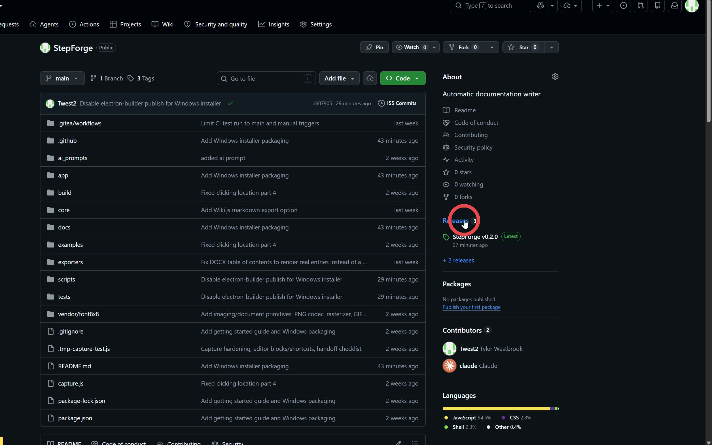
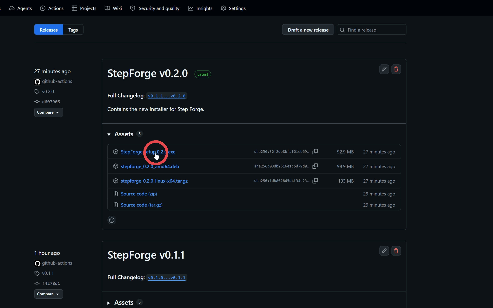
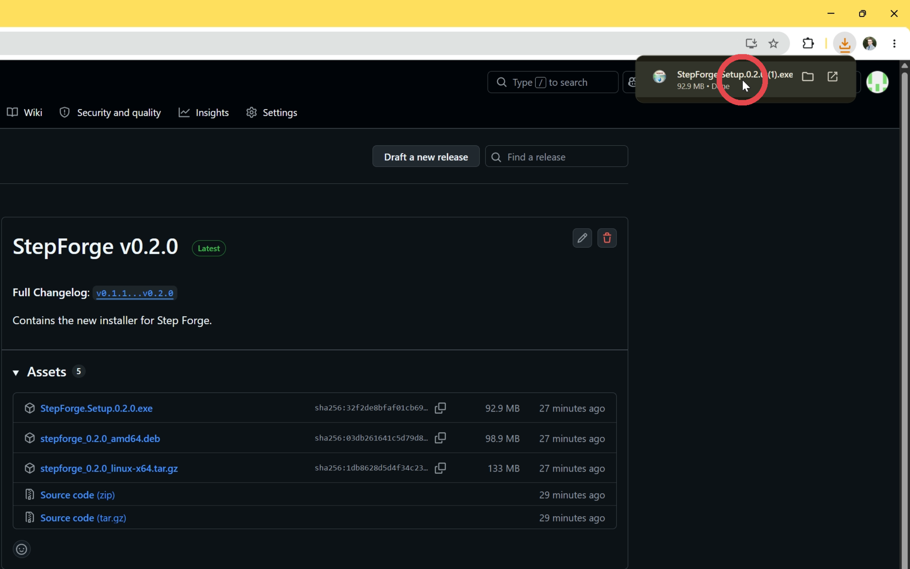
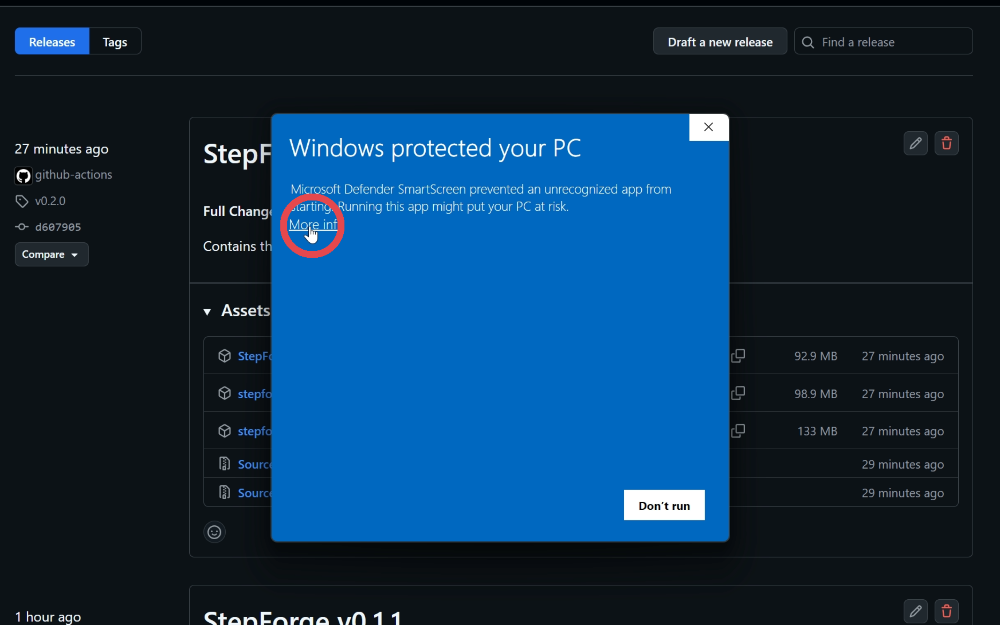
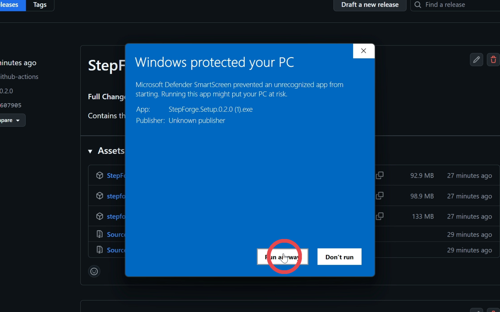
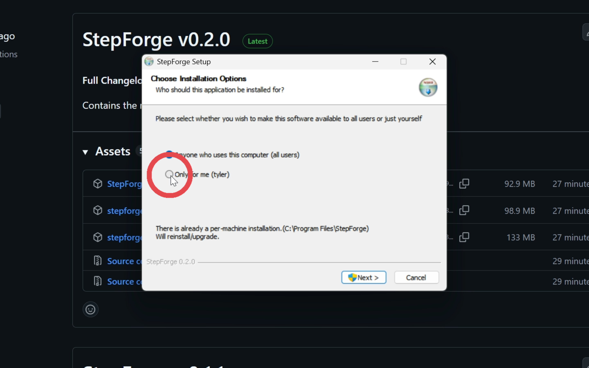
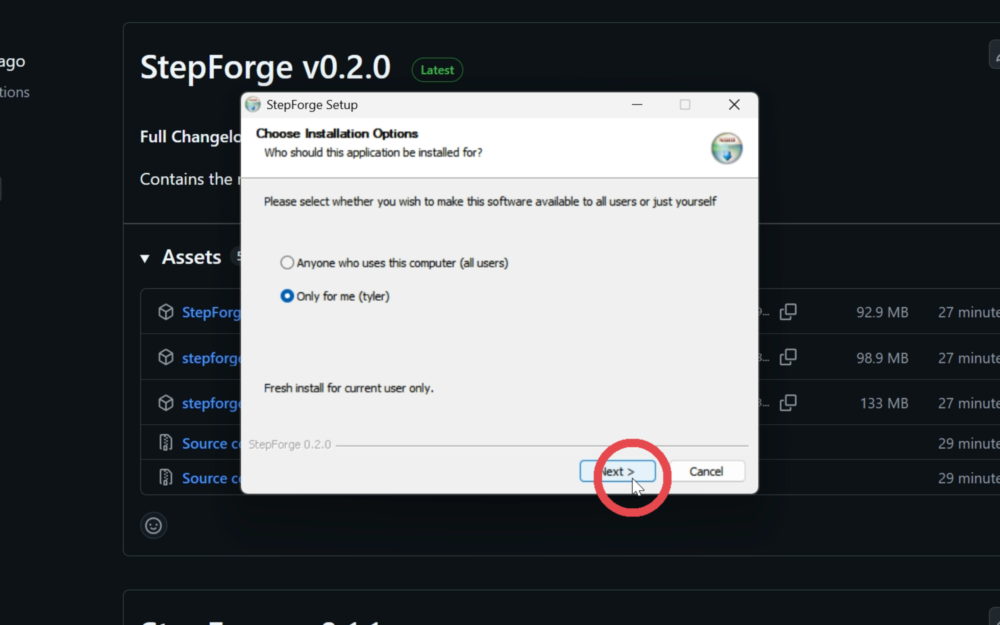
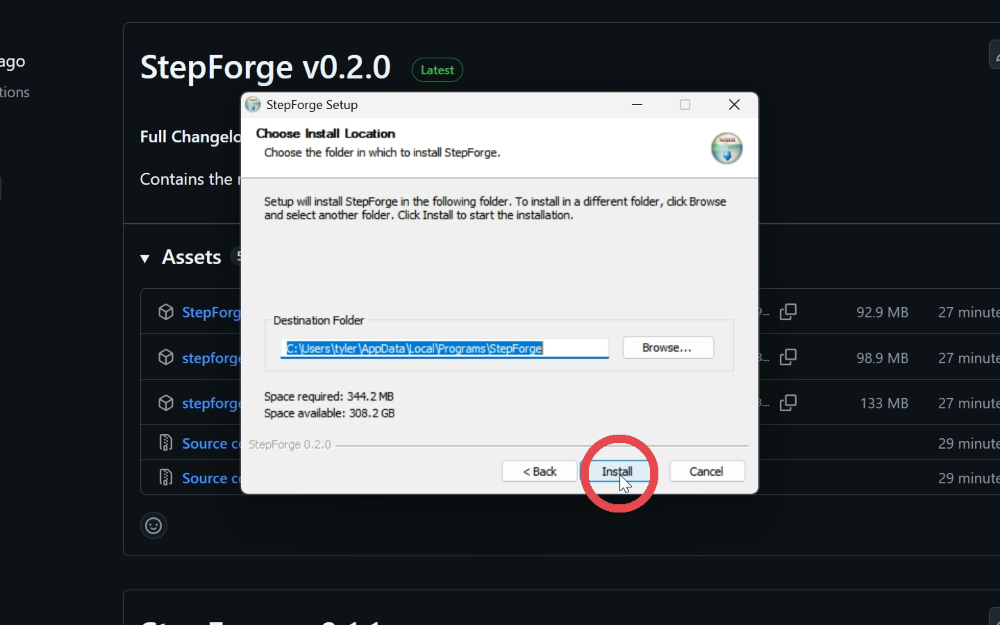
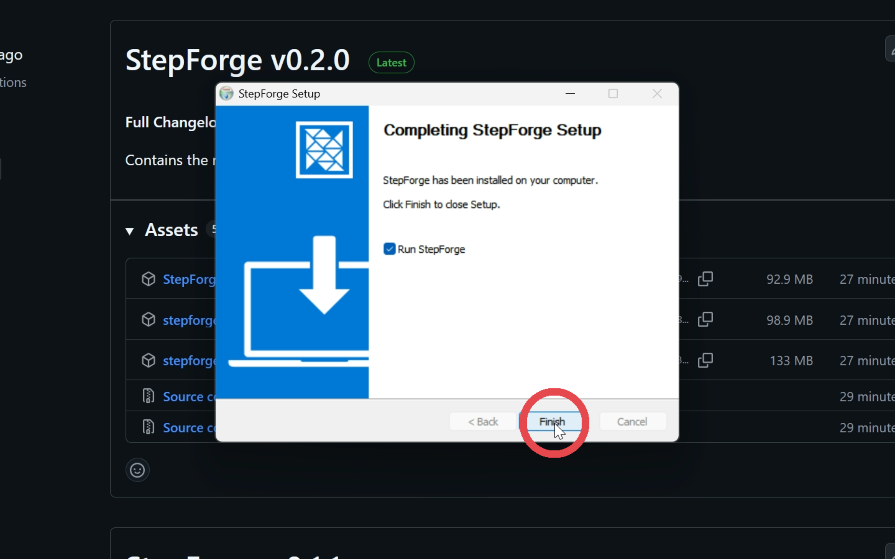

# Windows_installation

Author: Tyler Westbrook

*10 steps · generated 2026-06-23*

Welcome to StepForge the easy documentation writer! This guide shows you how to setup StepForge on your windows computer step by step. As a demo of this project, this guide was 100% made with StepForge with no outside editing. Enjoy!

## Contents

- [1. Navigate to the git repo.](#step-1)
  - [1.1. Click on releases](#step-1-1)
    - [1.1.1. Select the latest release for StepForge](#step-1-1-1)
- [2. Run the installer.](#step-2)
  - [2.1. Click More Info](#step-2-1)
    - [2.1.1. Select Run anyway](#step-2-1-1)
  - [2.2. Select install for me or install for all users](#step-2-2)
  - [2.3. Select next](#step-2-3)
  - [2.4. Select install](#step-2-4)
  - [2.5. Select Finish](#step-2-5)

## 1. Navigate to the git repo.

Navigate to the [Github Repository](https://github.com/Twest2/StepForge) located in the link.

### 1.1. Click on releases

### 1.1.1. Select the latest release for StepForge

Note: Newest version

Please make sure you select the newest version of StepForge, not v0.2.0. The .exe is an installer that will install the program for you.

## 2. Run the installer.

### 2.1. Click More Info

Important: Select More Info

Windows is warning you because this installer is new and hasn’t built up enough Microsoft SmartScreen reputation yet.

### 2.1.1. Select Run anyway

### 2.2. Select install for me or install for all users

### 2.3. Select next

### 2.4. Select install

### 2.5. Select Finish

Tip: You're finished!

Go ahead and play around with StepForge and make some docs!

