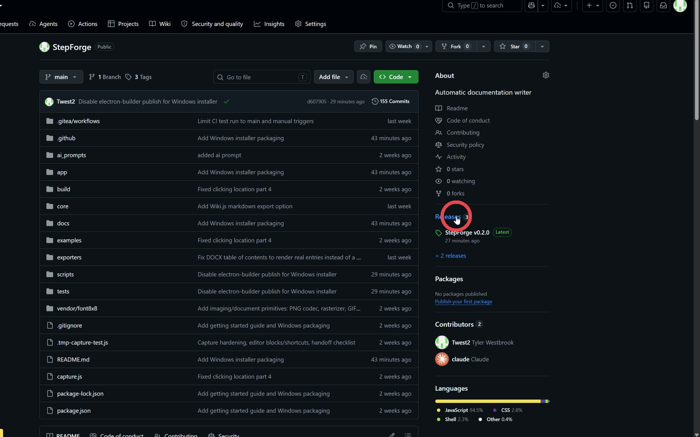
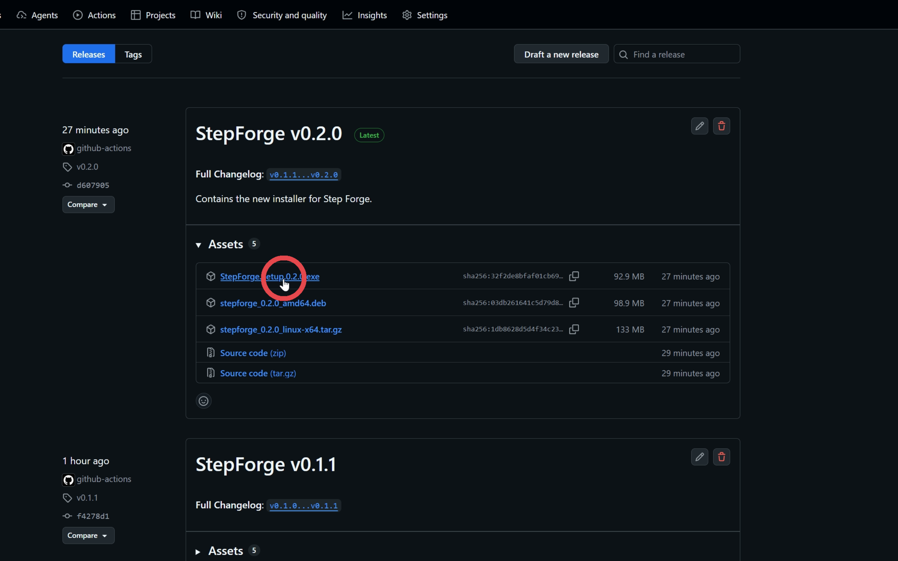
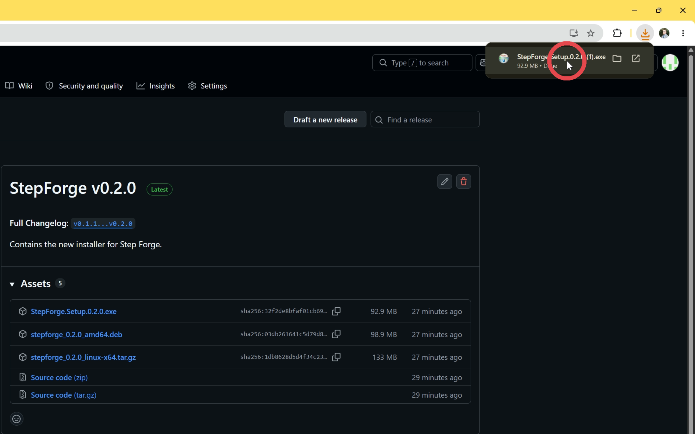
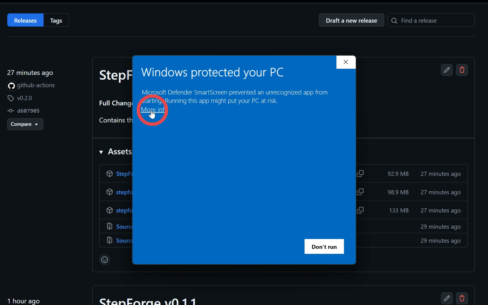
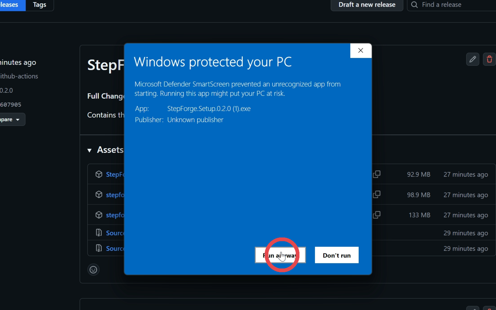
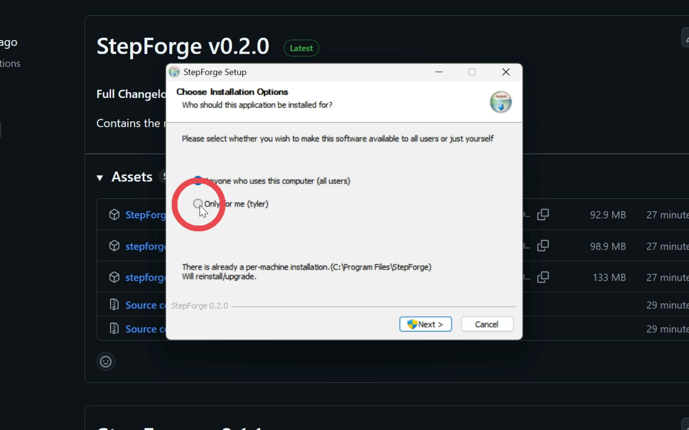
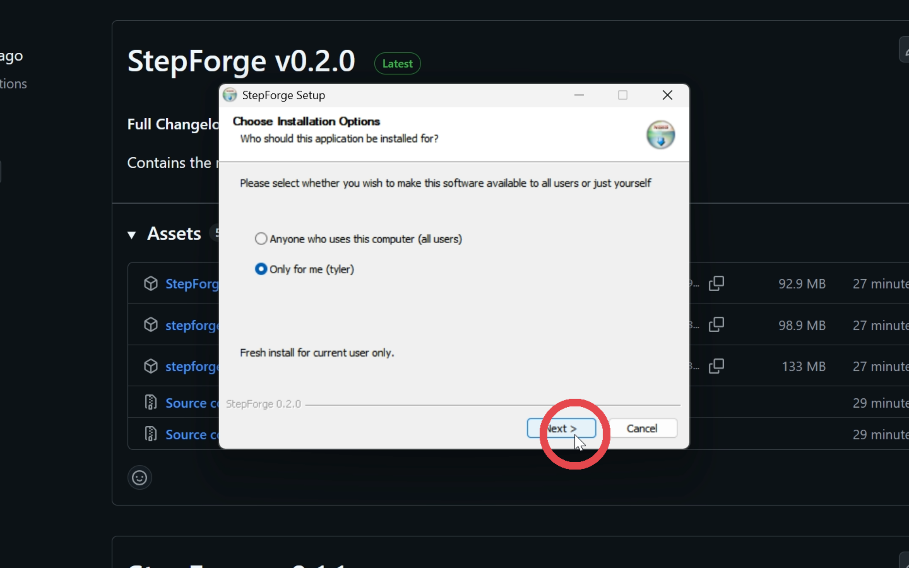
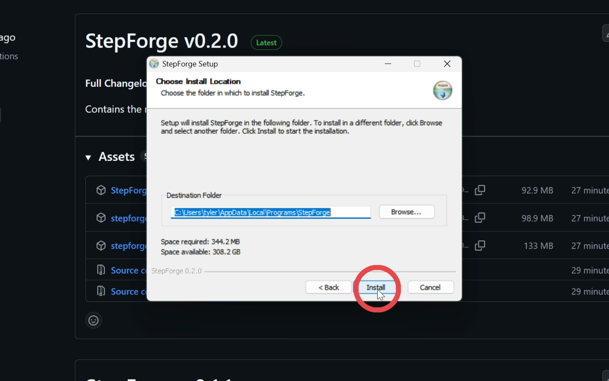
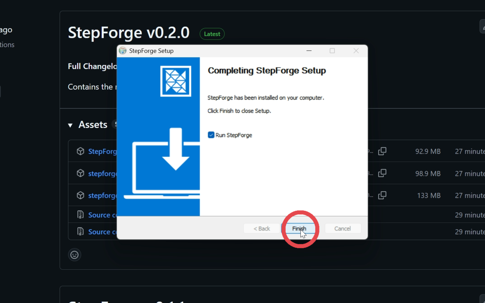

# Install StepForge on Windows

StepForge runs on **Windows 10 and Windows 11 (64-bit)**. Installing takes
about two minutes.

> [!TIP]
> **Prefer automatic updates?** Install with [Chocolatey](windows/chocolatey.md)
> instead. After a one-time setup, `choco upgrade stepforge` keeps you on the
> latest version and skips the SmartScreen prompt below.

*These instructions were recorded and exported with StepForge itself. The
red circles mark where to click.*

## 1. Download the installer

**1.1** Open the [StepForge repository on GitHub](https://github.com/Twest2/StepForge).

**1.2** In the right-hand sidebar, click **Releases**.

**1.3** Open the release marked **Latest** and, under **Assets**, download
the file named `StepForge.Setup.<version>.exe`.

> [!NOTE]
> Or skip straight to the [latest release](https://github.com/Twest2/StepForge/releases/latest).

## 2. Run the installer

**2.1** Open the file you downloaded.

**2.2** If Windows shows **Windows protected your PC**, click **More info**.

> [!IMPORTANT]
> Microsoft Defender SmartScreen shows this warning for new applications that
> haven't yet built up download reputation. It doesn't mean a problem was found
> with StepForge. Only continue if you downloaded the installer from the
> official GitHub Releases page.

**2.3** Click **Run anyway**.

**2.4** Choose whether to install StepForge **only for you** or **for all
users** of this computer. Installing for all users needs administrator rights.

**2.5** Click **Next** to keep the default install location.

**2.6** Click **Install**.

**2.7** Click **Finish**. StepForge opens and is ready to use.

## Next steps

- Record your first guide with the [Getting Started guide](GETTING_STARTED.md).
- StepForge appears in the Start menu as **StepForge**.

## Updating and uninstalling

**To update,** download the newest installer from
[Releases](https://github.com/Twest2/StepForge/releases/latest) and run it.
Your guides and settings are kept. A manual install does not update itself,
so consider switching to [Chocolatey](windows/chocolatey.md), which you can do
at any time without uninstalling first.

**To uninstall,** open **Settings → Apps → Installed apps**, find
**StepForge**, and choose **Uninstall**. Your guides stay in
`%APPDATA%\stepforge` in case you reinstall. Delete that folder if you want
them gone too.
