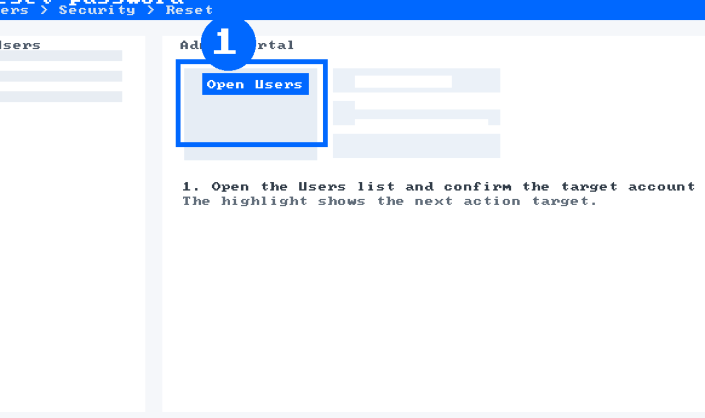
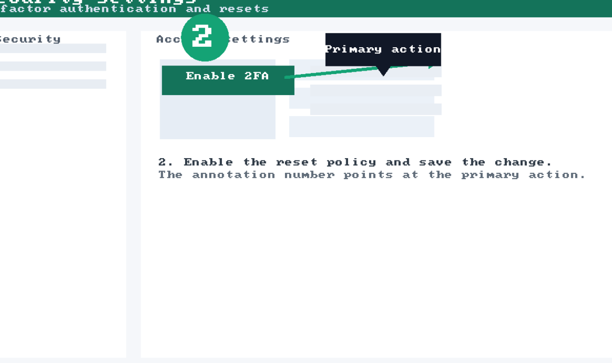
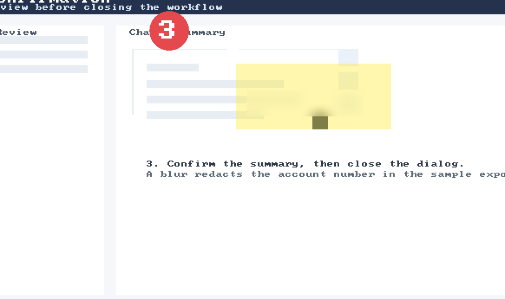

# Reset a password in Admin Portal

Offline sample guide showing capture, annotations, rich text, and exports.

## Contents

- [1. Open Admin Portal users](#step-1)
- [2. Enable the reset policy](#step-2)
  - [2.1. Confirm permission prompt](#step-2-1)
- [3. Review the confirmation](#step-3)

<a id="step-1"></a>

## 1. Open Admin Portal users

Open the users list and select the target account.



> **Note: Tip**
> Use the search box to avoid scrolling.

<a id="step-2"></a>

## 2. Enable the reset policy

Make sure the policy is active before continuing.



```bash
stepforge --capture --window --delay 300
```

<a id="step-2-1"></a>

### 2.1. Confirm permission prompt

Only administrators can complete this step.

> **Warning: Access**
> Admin rights required.

<a id="step-3"></a>

## 3. Review the confirmation

Confirm the summary and close the modal.



| Field | Value |
| --- | --- |
| Title | Admin Portal |
| Owner | Support |

