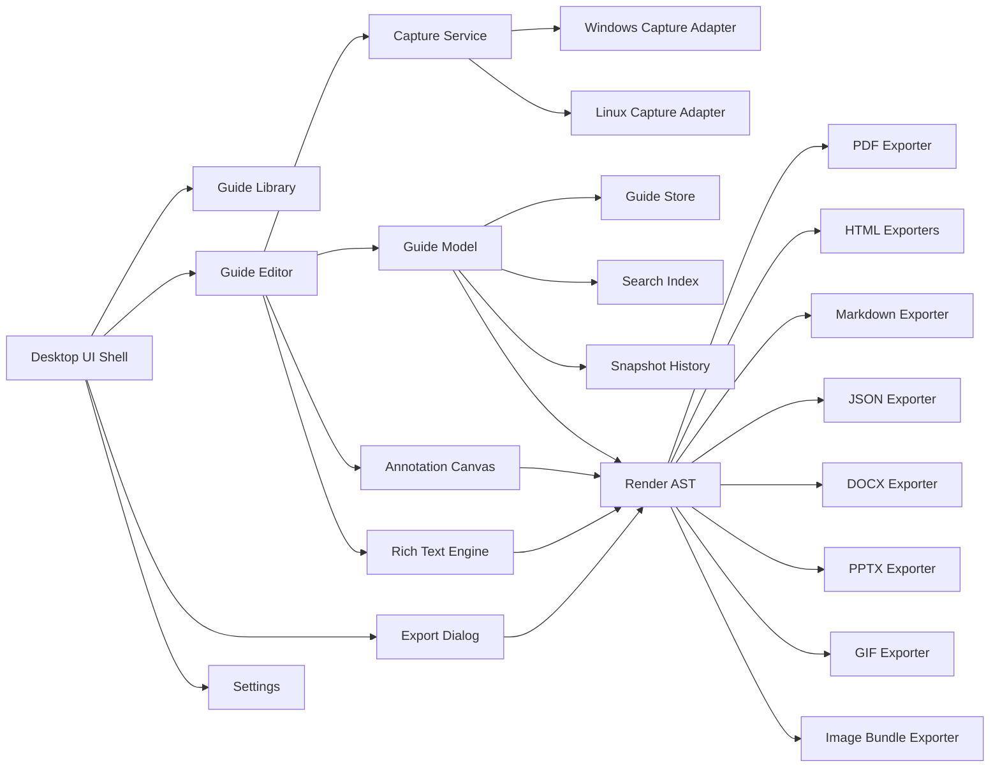
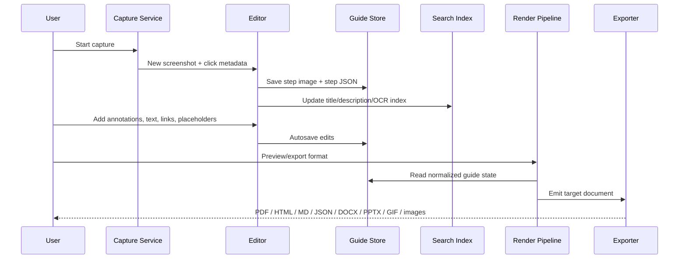

# Deep Research Report on Building a Fully Offline Open-Source Desktop Clone of Folge

When making tests, do not make it so that the test check for certain words, check actual workflows and make sure that the output is whats expected.

## Executive summary

Folge is a privacy-first desktop documentation tool centered on an unusually effective workflow: capture screenshots automatically while working, annotate them with a focused visual editor, then export the result into multiple documentation formats. The core desktop product is officially described as local-first, with screenshots, captures, edits, and exports happening on the user’s machine. Official materials also document a wide range of local features: click-triggered capture, active-window/full-screen/region capture, WYSIWYG editing, OCR-assisted title/text extraction, rich annotation tools, multi-image steps, placeholders, export templates, JSON/Markdown/HTML/PDF/Word/PowerPoint/GIF outputs, backups, and shared-file collaboration via `.flgg` files. At the same time, some newer Folge capabilities are expressly networked, including cloud publishing, direct knowledge-base integrations, and BYOK AI helpers. A strict “fully offline clone” therefore cannot literally replicate every networked feature without violating your constraints; the correct target is parity with Folge’s **desktop-local workflow surface**, while intentionally omitting or replacing cloud-only and online-only features. citeturn1view0turn36view0turn13view0turn17view0turn24view0

For an offline, open-source clone targeting **Windows and Linux desktop**, the strongest default implementation target is a **Rust-based core with a lightweight cross-platform desktop shell**, a **minimal three-pane UI**, a **folder-based internal guide store**, a **single-file share/archive format**, an **offline full-text search index**, and a **render-graph export pipeline** that emits HTML, Markdown, JSON, PDF, DOCX, PPTX, GIF, and image bundles. That architecture best fits Folge’s public behavior while improving crash recovery, reproducibility, and Linux packaging. The one major design departure I recommend is this: use **folder-based working storage internally** and **single-file archives externally**. Folge’s own docs indicate internal storage is not directly user-accessible and that backups/sharing are file-based via `.flgg`; a clone can preserve the same sharing ergonomics while making local storage more robust and auditable. citeturn31view0turn32search1

A realistic effort estimate for a polished, parity-oriented offline clone is roughly **300 to 350 developer-hours** for a disciplined implementation, with exports and the image/canvas editor taking most of the time. If time is constrained, the highest-value subset is: local guide library, capture modes, step editor with annotations, autosave/undo, Markdown/HTML/JSON/PDF export, backups/share-file workflow, and keyboard shortcuts. Features that should be treated as explicitly optional for the offline build are cloud publishing, remote AI providers, remote KB integrations, and any license-validation or telemetry path. Folge’s own security page states that the official app may perform license validation, update checks, and crash reporting even though documentation content stays local; your clone should remove those code paths entirely to keep the guarantee simple and auditable. citeturn36view0

## Folge feature inventory

The inventory below is grounded in Folge’s official site, user manual, export docs, security page, and changelog.

| Area | What the official sources confirm | Implication for an offline clone |
|---|---|---|
| Core product model | Folge is a desktop app for step-by-step guides and process documentation; it captures screenshots on every mouse click, lets users annotate/reorder steps, and exports to PDF, Word, PowerPoint, HTML, Markdown, JSON, GIF, and image-bundle-style outputs depending on page/version. Official marketing counts are inconsistent across pages: some pages say 7 export formats, others say 8, 9, or 10 depending on whether GIF, online guides, widgets, and native integrations are counted. citeturn1view0turn13view0turn14view0turn17view0turn38view2 | Treat the stable parity target as the **local desktop workflow plus local file exports**. Do not chase every marketing count; implement explicit offline formats and document the scope clearly. |
| Privacy / offline behavior | Official FAQ and security docs state that guides, screenshots, and documentation are stored locally and that captures/edits/exports happen on the computer. The security page also says the official app may still do license validation, update checks, and crash reporting; cloud content is only sent when the user explicitly publishes/resyncs. citeturn1view0turn36view0 | For a strict offline clone, remove **all network code paths** entirely, including telemetry, update checks, remote licensing, and remote AI. |
| Platform support | Official homepage says Windows and macOS; changelog/system-requirements text also mentions older Windows versions. A collaboration doc, however, says `.flgg` files can be opened by double-clicking on macOS, Windows, and Linux, which creates an inconsistency in the official materials. citeturn1view0turn39view0turn32search1 | Your Linux target is a meaningful differentiator. Document that your clone is **Windows/Linux-first**, and note that official Folge platform messaging is inconsistent on Linux. |
| Capture workflow | Capture can be automated on mouse click, keypress, or custom key combinations; modes include active window, full screen, and user-defined region; capture can be paused and resumed; screenshot delay is configurable; simple screenshot is also supported; active-window, fullscreen, and region workflows are described in the manual and features page. citeturn30search0turn5view6turn37view1turn39view4 | Must-have parity. This is the product’s defining workflow and should be implemented before any advanced exports. |
| Automated annotations and OCR | Official features/manual pages say Folge can prefill step titles from clicked UI metadata and use OCR to extract text from screenshots; changelog calls this “Automated annotations.” citeturn30search4turn37view1turn39view3 | Good parity target, but acceptable to stage it after core capture/edit/export. OCR can be local-only. |
| Editor layout and UX | The editor is described as a three-panel workspace: steps list, image editor/canvas, and properties panel. The WYSIWYG description editor supports bold, italic, lists, links, spellcheck, and installed fonts. citeturn30search0turn37view3 | Use a **minimal three-pane UI**. This is one of the few publicly explicit UX structures. |
| Step model | Official docs describe three step types: image step, empty step, and content block. Step settings include forcing a step onto a new page, content block behavior, and multi-image-step behavior. Substeps are supported. citeturn3search2turn3search4turn20search4turn5view4 | Keep the model graph-based, not flat. A step tree with top-level steps and substeps is required. |
| Step management | Users can add, import, duplicate, skip, delete, bulk-crop, bulk-change status, move to position, and change parent step. Multiple steps can be selected with Ctrl/Cmd-click. citeturn20search5turn11view0 | Implement right-click or contextual actions from the step list. |
| Search | Local guide-library search filters guides in the Guides List; Quick Actions can search guide titles from anywhere in the editor. Official docs do **not** clearly document local full-text search over step content. Full-text search is documented for Folge Cloud help centers, not for the local desktop library. citeturn5view7turn18view1turn10view4 | To hit parity, title search is enough. To exceed parity usefully, add local full-text search over steps and OCR text. |
| Multi-document handling | Folge has a Guides List, folders, favorites, quick actions, duplicate/move/delete, and shared linked guides. Theme updates are said to apply to all open Folge windows, implying multi-window behavior, though explicit window-management docs are limited. citeturn32search2turn18view1turn7search4 | Implement a guide library with folders/favorites and allow opening multiple guides, even if the initial UI uses one main window and tabs. |
| File formats and local storage | Guides are stored internally and not directly accessible. Backup/restore and “Share as File” use `.flgg`. Opening shared `.flgg` files creates linked guides that save back to the file. Templates for export settings use `.flgst`. JSON and Markdown exports place screenshots in `steps-GUIDE_TITLE` folders. citeturn31view0turn32search2turn32search1turn7search3turn15view0turn15view1 | Best clone behavior: internal folder-based guide store plus single-file share/archive format and per-format export templates. |
| Versioning and collaboration | Folge does not document git-style version history or real-time collaborative editing. What it does document is manual backup/restore, automated backups, live-linked shared `.flgg` files, lock files (`filename.lock-flgg`), manual save with Cmd/Ctrl+S, and “last write wins” risks. citeturn39view5turn32search1turn31view0 | Implement **snapshot backups + share-file locking**, not real-time collaboration. |
| Undo / redo | The changelog documents image editor undo/redo, rewritten image canvas history, and cover-page-editor undo/redo. The cover page editor UI explicitly includes Undo/Redo. Broader editor undo/redo behavior is not exhaustively documented. citeturn11view0turn10view0turn17view1 | Implement command-based undo/redo for canvas, step list operations, and rich-text edits. |
| Autosave | Guide title/description autosave as you type; text on the canvas autosaves while typing; export settings are saved as changed. Linked guides still require explicit save to shared file. citeturn10view2turn39view6turn11view0turn32search1 | Autosave should be local and aggressive; shared-file save should remain explicit. |
| Keyboard shortcuts | Official shortcuts include previous/next step, copy/paste selected canvas element, delete step, create step from clipboard image, zoom controls, tool hotkeys (`S`, `R`, `O`, `L`, `A`, `T`, `N`, `U`, `B`, `J`, `C`, `G`, `M`), and arrow-key nudging. Quick Actions uses Cmd/Ctrl + `/`. citeturn5view8turn18view1 | Must-have parity. Keep the tool palette keyboard-driven. |
| Settings | Official settings include capture-outside-clicks, screenshot delay, simple-capture confirmation, cursor display, click-marker settings, capture hotkeys, date format, preview-step count, open-folder-after-export, appearance (System/Light/Dark), focused-view default for new steps, spellchecker toggle, app language, and compatibility capture mode. citeturn5view6turn7search4 | Your clone should have a compact settings dialog, but these are the parity-defining settings. |
| Theming | Dark mode arrived in v1.35.0, with System / Light / Dark; settings docs say theme changes apply immediately and follow OS theme when set to System. citeturn39view0turn7search4 | Minimal UI should still include theme support from day one. |
| Annotations and image handling | Official docs/features/changelog cover rectangles, ovals, lines, arrows, curved arrows, brush/free draw, text, tooltips, cursor overlays, auto-numbered step numbers, blur, highlight, magnify, spotlight, crop, batch crop, watermarking, and apply-style-across-steps. Multiple image formats are supported for step images, including JPG/PNG/GIF imports. citeturn18view2turn38view0turn39view0turn39view1turn39view2turn15view5turn20search7 | The annotation canvas is the second major parity anchor after capture. |
| Focused view | Focused view crops/scales around the cursor for consistent export sizing; it can be enabled per step, per guide, or by default for new steps. It does not modify the original image. citeturn18view4 | Worth implementing because it materially changes export quality with minimal UI cost. |
| Informational blocks and placeholders | Folge supports informational text blocks on steps and placeholders at global, guide, and system scope. Placeholder bulk editing was added later. Cover pages also support placeholders such as `[[Guide_Title]]`. citeturn3search7turn18view3turn17view1turn39view1 | High-value parity feature for reusable SOPs and controlled exports. |
| Code blocks, tables, syntax highlighting | Changelog documents a new text editor enabling tables and step links, plus a code-block element with later UX improvements. However, official sources reviewed do **not** clearly document syntax highlighting behavior. citeturn27view0 | Implement code blocks and tables; treat syntax highlighting as optional/value-add rather than parity-critical. |
| Live preview | Official docs explicitly document preview flows for PDF, GIF, and cover pages. The editor itself is WYSIWYG rather than a split live-preview markdown environment. citeturn17view0turn17view1turn5view6 | Implement export previews and keep the editor direct/manipulative. |
| Exports | Official export surfaces include PDF, Word, PowerPoint, Simple HTML, Rich HTML, JSON, Markdown, GIF, image export/watermarking, plus cloud outputs and native integrations. HTML can be self-contained; Rich HTML includes checkboxes and floating TOC; JSON exposes structured step data; Markdown supports Azure DevOps wiki conventions; PDF customization is HTML/CSS based. citeturn13view1turn13view2turn13view3turn14view0turn15view0turn15view1turn15view2turn15view3turn15view4turn17view0turn15view5 | Offline parity should include JSON, Markdown, HTML, PDF, DOCX, PPTX, GIF, and image bundles. Remote integrations should be omitted in the offline build. |
| Templates and custom styling | Export settings templates can be imported/exported as `.flgst` files, are format-specific, and support rename/duplicate/delete. PDF/HTML exports accept custom CSS; PDF is generated from HTML/CSS internally. citeturn7search3turn15view2turn15view3turn15view4 | A clone should preserve **template-per-format** behavior and store render templates as plain JSON/YAML plus optional CSS snippets. |
| Plugins / extensions | The reviewed official materials document **native integrations**, export templates, CSS customization, JSON/Markdown outputs, and a public roadmap, but they do **not** document a public plugin SDK or extension API. citeturn1view0turn13view0turn38view2 | Omit plugins in v1. Make exporters modular in code, but do not expose a third-party plugin system initially. |
| Encryption | Official security docs describe TLS in transit and encryption at rest for cloud storage, but they do **not** document local at-rest encryption for the desktop guide store. citeturn36view0 | Local encryption is not parity-required from the official docs; adding optional encrypted share files would be a prudent improvement. |
| AI / online-only features | Official AI Helper and AI Voice Input are BYOK features tied to external providers or custom OpenAI-compatible endpoints; cloud publishing and hosted widgets are also documented network features. citeturn24view0turn27view0turn14view0 | Exclude these from the strict offline build, or replace later with optional **local-only** AI modules. |

### What parity should mean in this project

For your stated constraints, the correct parity target is:

**Include** capture, guide library, step tree, annotation canvas, rich-text descriptions, placeholders, backups/share files, local search, shortcuts, settings, theming, and local file exports.

**Exclude or explicitly defer** cloud publishing, embedded hosted widgets, remote knowledge-base publishing, remote AI providers, license-validation calls, telemetry, and update checks. Those are either contradicted by the no-online requirement or not central to the local desktop experience. citeturn36view0turn13view0turn24view0

## Stack options and recommended target

### Recommended default for a one-run code-generating agent

For a single-run build by a capable local agent, I recommend this default target:

**Rust core + Tauri desktop shell + TypeScript/React UI + SQLite FTS5 + HTML-based rich text + a custom annotation canvas model.**

Why this is the best default:

- It keeps the **security-critical and file-format-critical logic** in Rust.
- It makes the **editor UX** easier to generate and iterate because browser-style UI tooling is better suited to a Folge-like three-pane editor.
- It preserves a **small native desktop footprint** while still giving reliable filesystem, image-processing, and export control.
- It is more likely to yield a usable minimal UI in one pass than a pure Qt/C++ build or a custom immediate-mode GUI.

### Stack comparison

| Option | Proposed stack | Strengths | Weaknesses | Best use |
|---|---|---|---|---|
| Preferred | **Rust + Tauri + React/TypeScript + SQLite FTS5** | Small footprint, strong local-file safety, good Linux/Windows desktop story, easier UI generation, good exporter architecture | Rust/TS split adds integration complexity; screen capture and hotkeys still need OS adapters | Best overall balance for your goal |
| Alternative | **C#/.NET + Avalonia + SQLite** | Single primary language, strong desktop patterns, very productive on Windows, good Linux reach | WYSIWYG/canvas/editor integration is less straightforward; packaging matrix usually needs more custom glue | Best if your local environment is .NET-heavy |
| Heavy native | **Qt 6 + QML/C++ + SQLite** | Excellent native desktop feel, strong graphics/rendering, robust PDF/print support | Highest build complexity, slower agent productivity, steeper contributor curve | Best if you want a long-term desktop platform rather than fastest one-shot build |

### Concrete module choices

For the preferred stack, I recommend these concrete module decisions:

| Concern | Recommended choice | Rationale |
|---|---|---|
| Language split | Rust for core; TS/React for UI | Keeps model/storage/export deterministic while allowing a fast UI build |
| GUI shell | Tauri-style desktop shell | Minimal desktop frame, native menus/tray/hotkeys, small memory footprint |
| Rich text | Canonical storage as sanitized HTML fragments; editor emits/imports HTML | Simplifies HTML/PDF/DOCX export paths and preserves tables/links/code blocks |
| Annotation canvas | Custom JSON scene graph rendered in the UI | Exporters can render the same annotations independent of editor library |
| Local search | SQLite + FTS5 shadow tables | Single-file searchable index, easy rebuilds, no extra daemon |
| Image pipeline | Rust-based image transforms | Reliable crop/blur/watermark/thumb generation |
| PDF export | HTML/CSS intermediate -> PDF backend | Mirrors official PDF customization logic conceptually and centralizes layout |
| Markdown / JSON export | Direct from normalized render AST | Deterministic text exports |
| DOCX / PPTX export | Same render AST -> document emitters | Avoids duplicating business logic per exporter |

### Stack rationale relative to Folge’s public behavior

Folge’s official docs make clear that several important behaviors are actually **render-configuration behaviors**, not just editor behaviors: PDF is HTML/CSS-based, Markdown and JSON export create sidecar image folders, Rich HTML has its own structure and interactivity, export settings are templated per format, and GIF export is frame-based with preview and configurable overlays. That strongly argues for a clone architecture with a **shared render/document model feeding multiple exporters**, rather than separate ad hoc exporters bolted directly onto editor state. citeturn15view0turn15view1turn15view2turn15view3turn15view4turn17view0turn7search3

## Architecture and data model

### Recommended storage strategy

Use a **folder-based internal working format** and a **single-file external share/archive format**.

This is the cleanest answer to three competing needs:

- Folge-like sharing and backup ergonomics.
- crash-safe autosave and diff-friendly local state.
- easy recovery, thumbnails, caches, and search indexing.

### Internal and external format decision

| Format | Use | Why |
|---|---|---|
| Folder-based guide package | Internal working storage | Better autosave, easier cache invalidation, safer atomic writes, simpler thumbnails/search |
| Single-file archive | Backup/share/open-linked-guide workflow | Mirrors the convenience of `.flgg` while keeping the internal store more maintainable |

### Recommended on-disk layout

```text
stepforge-data/
  settings/
    app-settings.json
    shortcuts.json
    theme.json
    templates/
      pdf/
        default.template.json
      html-simple/
        default.template.json
      html-rich/
        default.template.json
      markdown/
        default.template.json
      docx/
        default.template.json
      pptx/
        default.template.json
      gif/
        default.template.json
  library/
    guides/
      0e6f4d8e-7a63-4c39-8fc8-6e607ef8f6bd/
        guide.json
        guide.html
        thumbs/
          cover.webp
        steps/
          0001/
            step.json
            original.png
            working.png
            thumb.webp
          0002/
            step.json
            original.png
            working.png
            thumb.webp
        attachments/
        cache/
          ocr.json
          preview-pdf/
          preview-gif/
        exports/
        history/
          snapshots/
            2026-06-10T19-22-11Z.stepforge-snapshot.zip
    index/
      library.db
  temp/
  shared-links/
```

### Recommended share-file format

Use a zipped archive such as:

- `.sfgz` for **shareable full-guide archive**
- `.sfglt` for **export-template archive**

That preserves the spirit of `.flgg` and `.flgst` without reusing Folge file extensions or branding.

### Recommended guide schema

```json
{
  "schemaVersion": 1,
  "guideId": "0e6f4d8e-7a63-4c39-8fc8-6e607ef8f6bd",
  "title": "Reset a user password in Admin Portal",
  "descriptionHtml": "<p>This SOP explains how to reset a user password safely.</p>",
  "placeholders": {
    "Author": "Tyler Westbrook",
    "Department": "Engineering"
  },
  "flags": {
    "focusedViewDefault": true,
    "hideSkippedStepsByDefault": true
  },
  "themeOverride": "system",
  "createdAt": "2026-06-10T19:22:11Z",
  "updatedAt": "2026-06-10T19:49:45Z",
  "stepsOrder": ["step-0001", "step-0002", "step-0003"],
  "favorites": false,
  "linkedSource": null,
  "exportProfiles": {
    "pdf": "default",
    "html-rich": "default",
    "markdown": "default"
  }
}
```

```json
{
  "stepId": "step-0002",
  "parentStepId": null,
  "kind": "image",
  "status": "done",
  "title": "Open the Users page",
  "descriptionHtml": "<p>Click <strong>Users</strong> in the left navigation.</p>",
  "index": 2,
  "indexString": "2",
  "hidden": false,
  "skipped": false,
  "focusedView": {
    "enabled": true,
    "zoom": 1.35,
    "panX": 0.18,
    "panY": 0.41
  },
  "image": {
    "originalPath": "original.png",
    "workingPath": "working.png",
    "size": { "width": 1920, "height": 1080 }
  },
  "annotations": [
    {
      "id": "ann-1",
      "type": "tooltip",
      "x": 0.62,
      "y": 0.21,
      "w": 0.20,
      "h": 0.08,
      "text": "Users",
      "style": {
        "fill": "#1F2937",
        "stroke": "#111827",
        "textColor": "#FFFFFF",
        "tail": "left"
      }
    }
  ],
  "textBlocks": [
    {
      "id": "tb-1",
      "position": "before-description",
      "level": "info",
      "title": "Permissions",
      "descriptionHtml": "<p>You need User Admin rights.</p>"
    }
  ],
  "links": [],
  "codeBlocks": [],
  "tableBlocks": []
}
```

### Search index approach

Implement a **single SQLite database** with:

- a guide table
- a step table
- an FTS5 virtual table over:
  - guide title
  - guide description plain text
  - step titles
  - step description plain text
  - placeholder values
  - OCR text extracted from screenshots

This is deliberately **stronger than officially documented parity**. Folge’s reviewed local docs prominently show title-based search and Quick Actions title search, but not clearly local full-text step-content search. A clone gains meaningful local value by indexing step content and OCR text while still keeping the UI minimal. citeturn5view7turn18view1turn30search4

### Plugin and extension model

My recommendation for v1 is an explicit **no third-party plugin system**.

That sounds conservative, but it is the right call for a single-run build:

- Folge’s public materials show native integrations, custom CSS, templates, JSON export, and roadmap surface, but no documented plugin SDK. citeturn1view0turn13view0turn38view2
- A plugin runtime complicates security, packaging, and reproducibility.
- Exporters can still be modular **inside the codebase**.

If you later want extensibility, add it as a **sandboxed exporter API** only, not as arbitrary code execution in the editor.

### Security model for a local-only app

A local-only clone should adopt these rules:

- no network calls in production code paths
- no hidden telemetry
- no automatic update checks
- no license checks
- no embedded remote fonts or CDNs in exports
- strict archive import validation to prevent path traversal
- atomic writes for autosave and linked-guide save
- lock files for linked/shared guides
- optional encrypted share archives as an enhancement, not a baseline

Because Folge’s own security page documents network-adjacent functions even in the desktop app, the clone will be materially simpler to review if it has **zero sockets**, period. citeturn36view0

### Component diagram



### Data-flow diagram



## Implementation plan and build pipeline

### Milestones and effort

| Milestone | Scope | Estimated developer-hours |
|---|---|---:|
| Foundation | repo layout, offline dependency policy, scripts, settings store, logging, app shell, basic CI | 16 |
| Core model and storage | guide schema, step schema, folder store, archive import/export, atomic autosave, snapshot history | 28 |
| Guide library | guides list, folders, favorites, title search, quick actions, linked-file open/share, lock files | 26 |
| Capture engine | active window, full screen, region capture, pause/resume, hotkeys, delay, click markers | 48 |
| Editor core | three-pane editor, step tree, statuses, hidden/skipped/trash, focused view, clipboard image import | 34 |
| Annotation canvas | shapes, arrows, tooltip, text, cursor, step numbers, blur, highlight, magnify, crop, bulk crop/apply style | 52 |
| Rich text and content blocks | HTML editor, tables, code blocks, step links, text blocks, placeholders, spellcheck hooks | 42 |
| Search and OCR | SQLite FTS5, OCR ingestion, search UI, result navigation | 24 |
| Exports | JSON, Markdown, HTML simple/rich, PDF, GIF, image bundle, DOCX, PPTX, preview pipeline | 80 |
| Polish | dark/light/system theme, shortcuts, settings UX, accessibility, performance fixes | 20 |
| Packaging and release | Windows `.exe`/`.msi`, Linux `.AppImage`/`.deb`/`.rpm`, release manifests, docs | 18 |

**Total:** about **388 hours** for near-parity polish. A strong MVP that feels real can be delivered in roughly **220 to 260 hours** by dropping DOCX/PPTX, OCR, and some advanced canvas features.

### Test plan

| Test class | What to verify |
|---|---|
| Unit tests | guide/step schema validation; archive import/export round-trips; placeholder expansion; render-AST normalization; search tokenization; link resolution |
| Image tests | crop/blur/highlight/magnify/watermark correctness; deterministic thumbnails; annotation scaling across different resolutions |
| Undo/redo tests | step add/delete/reorder; annotation create/move/edit/delete; text edits; focused-view state |
| Autosave tests | no data loss on forced close; crash recovery from temp files; linked-guide explicit save semantics |
| Export snapshot tests | stable JSON/Markdown/HTML outputs; PDF page count and TOC presence; GIF frame count and overlay controls |
| Integration tests | capture -> edit -> export end-to-end; clipboard image insertion; quick actions navigation; backup/restore; linked-guide lock conflict |
| Packaging smoke tests | fresh install on Windows/Linux VM; open existing guide; export PDF/HTML/GIF; file association for share archives |
| Accessibility tests | keyboard-only navigation; focus order; theme contrast; shortcut conflicts |

### Build and CI strategy

Because your requirement is fully local and no online services, the CI/build strategy should be **script-first**:

- `scripts/bootstrap-offline.*`  
  Verifies toolchains, local package caches, and vendored dependencies.
- `scripts/verify.*`  
  Runs format, lint, unit tests, integration tests, and export snapshots.
- `scripts/build-release.*`  
  Produces release binaries.
- `scripts/package-windows.*`
- `scripts/package-linux.*`

The same scripts should run:

- on a laptop
- in an air-gapped CI runner
- in any later hosted CI system

That keeps the release path reproducible without depending on an online CI platform.

### Packaging instructions

For the preferred stack, use this packaging policy:

#### Windows

Produce both:

- a **portable desktop executable**
- an **MSI installer**

Recommended artifact names:

- `stepforge-windows-x64-portable.zip`
- `stepforge-windows-x64-setup.exe`
- `stepforge-windows-x64.msi`

Implementation notes:

- the `.exe` installer can be generated with a local NSIS/Inno-style installer tool if present
- the `.msi` should be emitted via local WiX tooling if present
- if one packaging tool is unavailable offline, still produce the portable build plus installer source/spec files

#### Linux

Produce all of:

- `stepforge-linux-x86_64.AppImage`
- `stepforge_<version>_amd64.deb`
- `stepforge-<version>-1.x86_64.rpm`

Implementation notes:

- use local `appimagetool` or equivalent if available
- use `dpkg-deb` for `.deb`
- use `rpmbuild` for `.rpm`
- if AppImage tooling is absent, still produce a runnable unpacked AppDir and the spec/scripts to finalize it

### Minimum packaging acceptance criteria

A release build is only “done” if:

- it opens and creates a guide with no console attached
- the first-run path creates the local app-data structure
- PDF and HTML export succeed on a sample guide
- theme switching works
- shortcuts work
- an imported share file opens cleanly
- uninstall leaves user guides untouched unless the user explicitly asks to remove data

## Single-run AI agent prompt

Use the following prompt with a capable **local** code-generating agent that has filesystem access and can execute local shell commands. This prompt is intentionally long and operational.

```text
You are a senior desktop-software implementation agent. Build a fully offline, open-source Windows/Linux desktop app that clean-room reimplements the local desktop behavior of Folge’s documentation workflow without using Folge trademarks, assets, code, binaries, or proprietary text.

Project codename: StepForge
Artifact prefix: stepforge
License target: MPL-2.0 for app code, CC-BY-4.0 for bundled example templates and screenshots unless otherwise required by included local assets
Primary goal: implement the app in one run, locally, using only the local filesystem, installed toolchains, local caches, and vendored dependencies already present on disk. Never use online services. Never fetch from the network. Never curl, wget, git clone, npm install from the network, cargo add from the network, pip install from the network, or call remote APIs.

Non-negotiable constraints:

- Fully offline app. No telemetry. No update checks. No remote license checks. No cloud publishing. No remote AI.
- Desktop only. Windows and Linux only.
- Minimal UI, but polished and highly usable.
- Open-source and clean-room. Do not use the Folge name, icon, branding, screenshots, or exact export templates.
- Use only local resources. If a dependency is not locally cached or vendored, do one of the following:
  - use a vendored copy already present in ./vendor or in a known local cache
  - replace it with an internal implementation
  - gracefully fall back to a simpler implementation
- Produce installable artifacts for Windows and Linux when local packaging tools exist.
- If a packaging tool is missing, still produce the app binaries, packaging specs/scripts, and a clear build report describing what is ready and what local tool was missing.

High-level product scope:

Build a local app for capturing step-by-step workflows:
- guide library with folders and favorites
- create/edit/delete/duplicate/move guides
- title-based guide search and quick actions dialog
- shareable single-file guide archive
- linked guide open/save workflow with lock file for team use on shared folders
- automated backups and manual backups
- step-based editor with left guide tree, center canvas, right properties/settings panel
- step types: image step, empty step, content block
- substeps
- multi-image steps
- focused view crop/zoom/pan that does not modify original image
- statuses: todo / in-progress / done
- hidden/skipped/deleted/trash behaviors
- autosave for local edits
- explicit save for linked/shared guide files

Capture behaviors:
- active window capture
- full-screen capture
- region capture
- pause/resume capture
- screenshot delay
- click markers
- hotkey capture
- simple screenshot capture from inside editor
- clipboard image to new step
- import existing PNG/JPG/GIF images as steps

Editor behaviors:
- rich text title/description editor
- links
- tables
- code blocks
- step links
- informational text blocks
- placeholders
- spellcheck hook if local/enabled
- keyboard shortcuts
- undo/redo
- minimal but polished dark/light/system theme support

Canvas tools:
- selection
- rectangle
- oval
- line
- arrow
- text
- tooltip/callout
- cursor icon overlay
- auto-numbered step numbers
- blur
- highlight
- magnify
- crop
- batch crop of selected steps
- apply style to matching annotations across current step or whole guide
- preserve annotations as normalized JSON, not editor-library-specific serialized blobs

Exports to implement:
- JSON
- Markdown
- Simple HTML
- Rich HTML with checkboxes and floating TOC
- PDF
- animated GIF
- image bundle
- DOCX
- PPTX

Preview behaviors:
- preview for PDF
- preview for GIF
- preview uses first N steps
- output to temp preview area
- clean preview temp files on close when safe

Explicit omissions for this offline build:
- no cloud publishing
- no hosted widgets
- no Notion/Confluence/WordPress/Hudu publishing
- no remote AI helper
- no online sync
- no account system
- no analytics
- no auto-update

Implementation strategy:

First, inspect the local environment and produce build/agent_audit.md containing:
- OS
- installed compilers/toolchains
- presence of Rust/Cargo
- presence of Node package manager and local cache
- presence of .NET SDK
- presence of packaging tools:
  - WiX
  - NSIS / Inno
  - appimagetool
  - dpkg-deb
  - rpmbuild
- presence of vendored dependencies in ./vendor
- any local package caches that can be used offline

Stack-selection rule:
- Preferred path: Rust core + desktop shell + TypeScript/React UI if required dependencies are already vendored or cached locally
- Fallback path: Rust + native immediate-mode desktop UI if the TS/web stack cannot be completed offline
- Alternate fallback only if already locally cached: .NET/Avalonia
- Never choose a path that requires network dependency resolution

Project structure to create:

/README.md
/LICENSE
/CONTRIBUTING.md
/CODE_OF_CONDUCT.md
/SECURITY.md
/ARCHITECTURE.md
/.editorconfig
/.gitattributes
/.gitignore
/scripts/
/build/
/docs/
/examples/
/assets/
/vendor/   (reuse only; do not fetch)
/app/
/core/
/exporters/
/tests/

Required documentation files:
- README with feature list, screenshots or ASCII mockups, build instructions, packaging instructions
- ARCHITECTURE with model, storage, render pipeline, security rules, and offline guarantees
- SECURITY listing threat model, offline guarantee, import/archive risks, lock-file behavior
- CONTRIBUTING with clean-room and trademark rules
- CHANGELOG initialized
- examples/sample-guide.* and example exported outputs

Data-model requirements:

Use folder-based internal working storage and a single-file archive for sharing/backups.

Internal storage root:
- settings/
- library/guides/<guide-id>/
- library/index/library.db
- temp/
- shared-links/

Guide schema must include:
- schemaVersion
- guideId
- title
- descriptionHtml
- createdAt
- updatedAt
- placeholders
- preferred export profiles
- theme override
- steps order
- linked-source metadata if guide is linked to a shared archive

Step schema must include:
- stepId
- parentStepId
- kind
- status
- title
- descriptionHtml
- hidden
- skipped
- focusedView state
- image paths
- annotations array
- textBlocks array
- codeBlocks and tables
- step-link targets

Archive format:
- .sfgz
- zip-based
- include manifest, guide data, steps, and attachments
- validate all archive paths to prevent traversal
- support linked mode and copied-import mode

Search requirements:
- local SQLite database
- FTS over guide titles, guide descriptions, step titles, step descriptions, placeholders
- optional OCR text table if OCR implementation is available offline
- search UI in library and quick actions dialog

UI requirements:

Maintain a minimal three-pane workflow:
- left: steps tree / guide tree
- center: image canvas / focused view / preview
- right: properties, text blocks, step settings, object properties, export settings

Main screens:
- Guide Library
- Guide Editor
- Export dialog
- Settings dialog
- Backup/Restore dialog
- Linked Guide conflict dialog
- Quick Actions palette

Library requirements:
- folders
- favorites
- create guide
- duplicate guide
- delete guide
- move guide to folder
- search by title
- drag and drop reorder
- open archive
- save archive
- linked-file badge and path
- last-updated sorting

Linked guide behavior:
- opening an archive in linked mode creates a library entry pointing at the external file
- edits autosave locally but only write back to linked file when explicit save is triggered
- Cmd/Ctrl+S on linked guide writes back to archive
- use sidecar lock file named filename.lock-sfgz
- detect lock conflict
- allow user to discard or keep editing with warning
- document last-write-wins risk

Capture requirements:

Implement platform abstraction:
- Windows capture adapter
- Linux capture adapter

Need these modes:
- full screen
- active window
- region

Need these controls:
- start/finish
- pause/resume
- screenshot delay
- capture on click and/or hotkey
- simple screenshot from editor
- click marker and cursor overlay options

If automated UI metadata extraction is feasible offline, implement:
- step-title prefill from clicked element/window metadata
Otherwise:
- implement template-based fallback title generation using mode + timestamp

Editor requirements:

Rich text:
- canonical storage as sanitized HTML fragments
- import/export plain text shadow for search
- support bold/italic/underline/lists/links/tables/code blocks
- support inline step links with target stepId
- content block rendering mode

Canvas:
- normalized annotation scene graph in JSON
- coordinates should be resolution-independent
- annotations render identically in editor and exporters
- implement selection, drag, resize, arrow handles, nudge with arrows, faster nudge with shift

Undo/redo:
- command stack
- must cover step operations, annotations, focused-view edits, text edits when feasible
- autosave should not destroy undo intentionally; persist reasonable history when possible

Focused view:
- per step toggled
- per guide default
- application default for new steps
- stores zoom/pan only
- never mutates original image

Placeholders:
- global placeholders
- guide placeholders
- built-in system placeholders
- placeholder bulk editor
- placeholder expansion in exports and cover pages

Text blocks:
- before-description and after-description positions required
- if easy, also support before-title/after-title/before-image/after-image
- include info/warn/error/success variants

Code blocks:
- monospace rendering required
- syntax highlighting optional; if no local highlighting library is available offline, use plain monospace blocks

Export architecture:

Create a shared normalized Render AST.
All exporters must transform from the same Render AST, not directly from UI components.

Required exporters:
- JSON: structured guide + steps + image relative paths
- Markdown: guide title, TOC, steps, image paths, text blocks, code blocks, tables
- Simple HTML: lightweight copy-pasteable HTML
- Rich HTML: checkboxes, floating TOC, progress state in browser-local storage only
- PDF: HTML/CSS-backed if chosen stack supports this cleanly; otherwise native PDF generation from AST
- GIF: one frame per step, title card optional, progress bar optional, title overlay optional
- image bundle: one image per step plus metadata file
- DOCX
- PPTX

Export settings:
- per-format templates
- import/export templates as .sfglt
- template list with rename/duplicate/delete
- output directory remembered per format
- optional watermark image overlay for exported image-bearing formats

Preview:
- PDF preview
- GIF preview
- first N steps
- configurable N in settings
- preview temp cleanup

Recommended parity shortcuts:
- previous / next step
- delete current step
- create step from clipboard image
- zoom in / out / fit / 100%
- tool selection keys
- quick actions palette
- save linked guide

Testing requirements:

Create and run all of these locally:
- unit tests for schema, placeholder expansion, search indexing, archive validation
- command-stack tests for undo/redo
- render-AST tests
- exporter snapshot tests for JSON/Markdown/HTML
- smoke tests for PDF/GIF exports
- linked-guide lock conflict tests
- autosave recovery tests
- import/export archive round-trip tests

Put test data under:
- tests/fixtures/
- examples/

Build scripts required:
- scripts/bootstrap-offline.sh
- scripts/bootstrap-offline.ps1
- scripts/verify.sh
- scripts/verify.ps1
- scripts/build-release.sh
- scripts/build-release.ps1
- scripts/package-windows.ps1
- scripts/package-linux.sh

Packaging requirements:

Windows:
- produce a runnable app binary
- produce a portable zip
- if local installer tooling exists, produce:
  - stepforge-windows-x64-setup.exe
  - stepforge-windows-x64.msi
- if MSI or EXE installer tooling is missing, generate the installer spec/project files and say so in build/build_report.md

Linux:
- produce a runnable app directory and launcher
- if local tools exist, produce:
  - stepforge-linux-x86_64.AppImage
  - stepforge_<version>_amd64.deb
  - stepforge-<version>-1.x86_64.rpm
- if a packaging tool is missing, produce the package metadata/spec files and document the exact missing tool

Quality bar:
- app must start with an empty library
- user must be able to create a guide, capture or import a screenshot, annotate it, add text, and export to JSON/Markdown/HTML/PDF
- linked guide open/save must work if archive path is writable
- no network calls anywhere in the shipping app
- UI must remain minimal and not over-designed
- avoid unnecessary dependencies
- prefer deterministic outputs and stable file layouts
- prefer simple code over clever code

Clean-room legal rules:
- do not use Folge branding, name, or icons in the product
- do not copy wording from official docs into UI
- do not decompile or inspect proprietary binaries
- implement behavior from public descriptions only
- include a note in README that the project is an independent offline desktop guide-capture tool inspired by publicly documented workflow patterns

Required deliverables at the end:
- complete source tree
- tests
- build scripts
- package scripts
- build/build_report.md
- build/artifacts_manifest.json
- installable artifacts if local tools permit
- sample guides and sample exports
- final README that includes offline guarantee, build steps, and screenshots or ASCII mockups

Execution order:

Phase A:
- audit environment
- choose stack
- scaffold repo
- write architecture docs first

Phase B:
- implement core schema/store/search/archive
- implement guide library and settings
- implement quick actions and shortcuts

Phase C:
- implement capture service
- implement editor shell
- implement canvas scene graph and annotation tools
- implement autosave and undo/redo

Phase D:
- implement placeholders, text blocks, step links, tables, code blocks, focused view
- implement linked-guide save and lock behavior
- implement backups and restore

Phase E:
- implement Render AST
- implement exporters in this order:
  1. JSON
  2. Markdown
  3. Simple HTML
  4. Rich HTML
  5. PDF
  6. image bundle
  7. GIF
  8. DOCX
  9. PPTX

Phase F:
- add tests
- produce sample guide and snapshot fixtures
- run verification
- package artifacts
- write final build report

Final acceptance gate:
Do not stop after scaffolding. Continue until you have implemented the application, tests, build scripts, and release packaging scripts. If a feature cannot be completed because a required tool is absent locally, implement the fallback behavior or generate a stub/spec and record it explicitly in build/build_report.md. The default is to ship the most complete offline app possible in one run, not to handwave.
```

## Prioritized build checklist, sample UI, and governance

### Priority checklist if time becomes the limiting factor

If the agent cannot finish everything in one pass, this is the best value order:

| Priority | Feature slice | Why it matters most |
|---|---|---|
| Highest | guide library, foldering, favorites, title search, quick actions | makes the app usable as a real desktop tool |
| Highest | active-window/full-screen/region capture, delay, pause/resume, simple screenshot | this is the category-defining workflow |
| Highest | image step editor with annotations, statuses, substeps, focused view | without this, it is not a Folge-like experience |
| Highest | autosave, undo/redo, share archive, backup/restore | prevents data loss and supports real work |
| High | JSON, Markdown, Simple HTML, PDF export | highest practical value per effort |
| High | rich text editor with links/tables/code blocks/text blocks/placeholders | supports genuine SOP authoring |
| Medium | Rich HTML, GIF preview/export, image bundle, watermarking | strong differentiators |
| Medium | linked shared-guide mode with lock files | valuable for teams, but not required for solo use |
| Lower | OCR-assisted search, apply-style-across-steps, bulk blur similarity detection | useful but can follow |
| Lowest | DOCX, PPTX, local AI add-ons, advanced template exchange | nice to have after the core is stable |

### Sample UI mockups

#### Library view

```text
┌──────────────────────────────────────────────────────────────────────────────┐
│ StepForge                                                   Search: [____ ] │
├───────────────┬──────────────────────────────────────────────────────────────┤
│ Favorites     │ Guides                                                       │
│  ★ Onboarding │                                                              │
│  ★ Admin SOPs │  ▸ IT Support                                                │
│               │    • Reset Password                              12 steps    │
│ Folders       │    • Install VPN                                 9 steps     │
│  ▸ IT Support │  ▸ Onboarding                                                │
│  ▸ Training   │    • New Hire Setup                              15 steps    │
│               │                                                              │
│ [New Guide]   │ [Open Archive] [Backup] [Restore] [Settings]                │
└───────────────┴──────────────────────────────────────────────────────────────┘
```

#### Editor view

```text
┌────────────────────────────────────────────────────────────────────────────────────────────┐
│ StepForge  >  Reset Password SOP                     [Capture] [Export] [Save Linked]     │
├───────────────────────┬──────────────────────────────────────────────┬─────────────────────┤
│ Steps                 │ Canvas                                       │ Properties          │
│                       │                                              │                     │
│ 1  Open Users         │   ┌──────────────────────────────────────┐   │ Step                │
│ 2  Search account     │   │                                      │   │ Title              │
│ 3  Click Reset        │   │   [tooltip]                          │   │ [Reset password]   │
│ 4  Confirm dialog     │   │        ↘                             │   │                     │
│   4.1 Warning note    │   │         ┌─────────────┐             │   │ Description         │
│ 5  Done               │   │         │ Reset btn   │             │   │ [rich text editor]  │
│                       │   │         └─────────────┘             │   │                     │
│ [Add Step]            │   │                                      │   │ Text Blocks        │
│                       │   └──────────────────────────────────────┘   │ Step Settings      │
│                       │                                              │ Object Properties  │
├───────────────────────┴──────────────────────────────────────────────┴─────────────────────┤
│ Tools: [Select][Rect][Oval][Line][Arrow][Text][Tooltip][Cursor][#][Blur][Hi][Mag][Crop] │
└────────────────────────────────────────────────────────────────────────────────────────────┘
```

### Sample archive layout

```text
reset-password.sfgz
  manifest.json
  guide.json
  steps/
    0001/step.json
    0001/original.png
    0001/working.png
    0002/step.json
    0002/original.png
  attachments/
  templates/
```

### License recommendations

For this project, I recommend:

| Component | Recommended license | Why |
|---|---|---|
| App source code | **MPL-2.0** | Good middle ground: open-source, contribution-friendly, file-level copyleft, easier adoption than GPL for desktop tooling |
| Alternative app license | **Apache-2.0** | Best if you want maximum commercial friendliness and the least adoption friction |
| Documentation and templates | **CC-BY-4.0** | Good for example SOPs and user-facing docs |
| Tiny example assets | **CC0** | Simplifies reuse in tests and screenshots |

### Contributor guidelines I recommend

Your repository should include these contributor rules from day one:

- clean-room implementation only
- no reverse engineering of proprietary binaries
- no copying Folge’s logos, icons, screenshots, or UI strings
- keep file formats documented and versioned
- require tests for every exporter or storage change
- require snapshot fixtures for output changes
- require changelog entries for user-visible behavior changes
- use a **Developer Certificate of Origin** sign-off rather than a heavy CLA unless you already expect enterprise legal review
- include `SECURITY.md` for offline-import and archive-handling issues
- include `ARCHITECTURE.md` so future contributors do not break exporter consistency

## Open questions and limitations

A few areas remain ambiguous in Folge’s public materials and should be treated carefully.

Official messaging around **export-format counts** is inconsistent across the homepage, features page, and export examples page; this appears to be caused by different counting of file exports versus cloud outputs and native integrations. citeturn1view0turn37view0turn13view0

Official messaging around **Linux support** is also inconsistent: the homepage frames Folge as Windows/macOS software, but the shared-file documentation mentions `.flgg` opening via double-click on Linux. I would not infer official Linux desktop support from that single doc alone. citeturn1view0turn32search1

I did not find a documented public **plugin SDK** in the reviewed official materials, only built-in integrations, templates, and customization surfaces. That is why I recommend omitting a plugin system in the clone’s first version. citeturn1view0turn13view0turn38view2

Finally, official docs clearly describe local storage and cloud encryption controls, but they do **not** clearly document local at-rest encryption for the desktop guide store. If you want encrypted local archives, that would be an improvement rather than a strict compatibility requirement. citeturn36view0